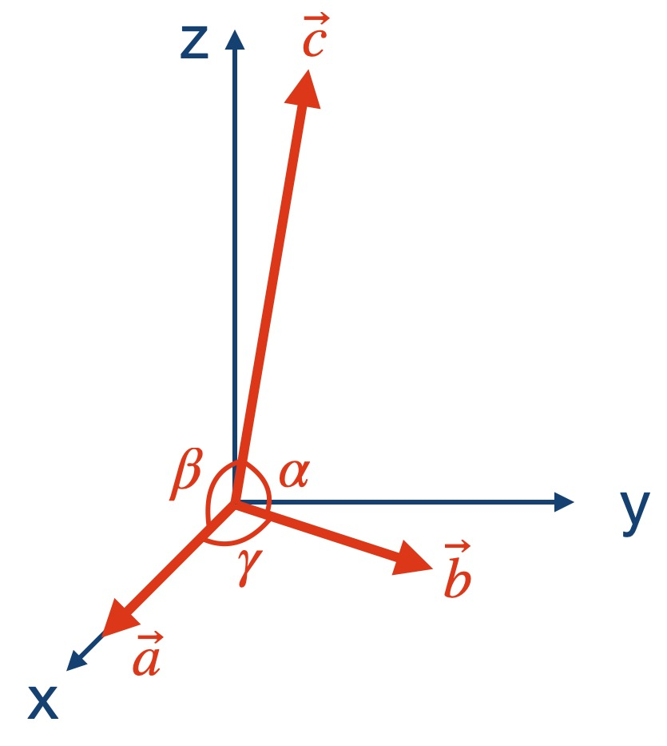
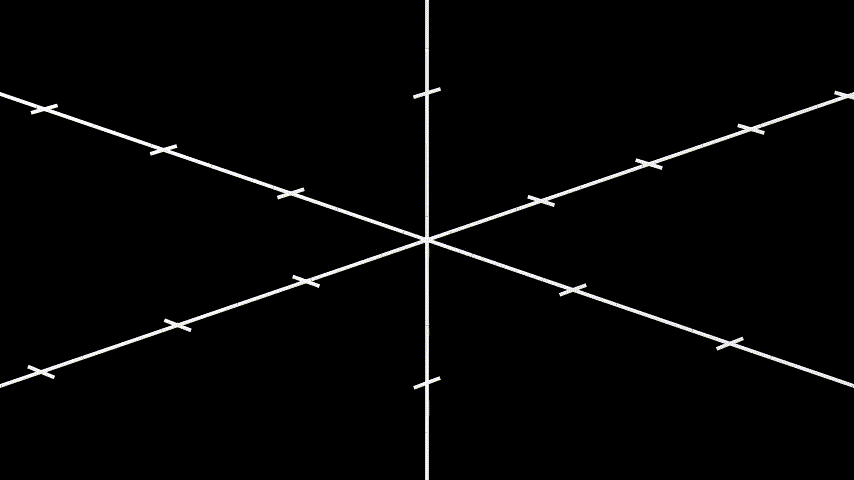
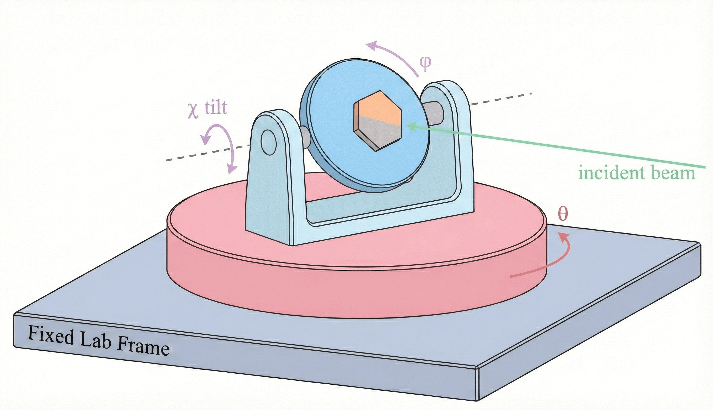

Appendix
========

Reference frames:
----------------

There are three reference frames in this app:
#. Lattice frame: the reference frame attached to the lattice. 
#. Sample frame: the reference frame attached to the sample holder or the goniometer stage.
#. Lab frame: the reference frame attached to the laboratory frame.

In our app, the orientation of the lattice frame relative to the sample frame (sample holder or goniometer stage) is termed as the
*sample orientation*. The rotation of the sample frame (goniometer stage) with respect to the lab
frame is termed as the *sample rotation*. 

The animation below shows the ordering of how the sample orientation (roll, pitch, yaw) and the
sample rotation (θ, χ, φ) are applied. To simplify the concept, the animation shows the 2D
projection. 

More details about the orientation and the rotation are given below.

Sample orientation:
-------------------

Sample orientation is the orientation of the underlying lattice relative to the
sample holder or to the goniometer stage. The orientation is defined by three Euler angles: roll,
pitch, and yaw in the ZYX convention. The setup of the lattice at zero orientation is shown below:

The first real-space lattice vector :math:`\mathbf{a}` is along the x-axis; The second real-space
lattice vector :math:`\mathbf{b}` is on the x-y plane, forming an angle of :math:`\gamma` with the
x-axis (or the vector :math:`\mathbf{a}`); The third real-space lattice vector
:math:`\mathbf{c}` is out-of-plane, forming an angle of :math:`\alpha` with :math:`\mathbf{b}`,
and an angle of :math:`\beta` with the vector :math:`\mathbf{a}`.

In a more general case, when yaw, pitch, and roll are not zero, the three vectors
:math:`\mathbf{a}`, :math:`\mathbf{b}`, and :math:`\mathbf{c}` need to be reoriented:

#. **Yaw**: rotation about the original z-axis;
#. **Pitch**: rotation about the new y-axis after the yaw rotation;
#. **Roll**: rotation about the new x-axis after the yaw and the pitch rotation.

The total rotation matrix is given by:

.. math::
   R_{\text{orientation}} = R_{\text{yaw}} R_{\text{pitch}} R_{\text{roll}}

where :math:`R_{\text{yaw}}`, :math:`R_{\text{pitch}}`, and :math:`R_{\text{roll}}` are the rotation
matrices for the yaw (z-axis), pitch (y-axis), and roll (x-axis) rotations, respectively. See the
video below for a visual demonstration.

Sample rotation, 
-----------------------

In this app, the sample rotation is defined as the rotation of the goniometer
stage. 

#. **θ** — primary/base rotation; rotation about the z-axis of the lab frame.
#. **χ** — secondary/tilt rotation; rotation about the new y-axis after the θ rotation.
#. **φ** — tertiary/sample azimuth; rotation about the new x-axis after the θ and χ rotations.

The total rotation matrix is given by:

.. math::

   R_{\text{rotation}} = R_{\theta}\, R_{\chi}\,  R_{\phi}

Momentum transfer HKL
----------------------

**H, K, L (r.l.u.)** — components of the momentum transfer :math:`\mathbf{Q}` in the reciprocal lattice basis.

.. math::

   \mathbf{Q} = H\,\mathbf{a}^* + K\,\mathbf{b}^* + L\,\mathbf{c}^*

Given real-space vectors :math:`\mathbf{a}, \mathbf{b}, \mathbf{c}` and volume :math:`V = \mathbf{a}\cdot(\mathbf{b}\times\mathbf{c})`:

.. math::

   \mathbf{a}^* = 2\pi\frac{\mathbf{b}\times\mathbf{c}}{V},\quad
   \mathbf{b}^* = 2\pi\frac{\mathbf{c}\times\mathbf{a}}{V},\quad
   \mathbf{c}^* = 2\pi\frac{\mathbf{a}\times\mathbf{b}}{V}

The equations below show how to convert the momentum transfer vector :math:`\mathbf{Q}` to the HKL coordinates:

.. math::

   H=\frac{\mathbf{Q}\cdot\mathbf{a}^*}{2\pi},\quad
   K=\frac{\mathbf{Q}\cdot\mathbf{b}^*}{2\pi},\quad
   L=\frac{\mathbf{Q}\cdot\mathbf{c}^*}{2\pi}

----

Structure factor planes (U/V/Center)
------------------------------------
The two vectors :math:`\mathbf{U}` and :math:`\mathbf{V}` span a plane in reciprocal space. The vector :math:`\mathbf{Q}_0` is the center of the plane. The U and V ranges control the size of the sampled plane in reciprocal space.

- **U vector** — in r.l.u., defines one in-plane direction. For example, ``1,1,0`` means 
.. math::
   \mathbf{U} = 1\,\mathbf{a}^* + 1\,\mathbf{b}^* + 0\,\mathbf{c}^*
- **V vector** — in r.l.u., defines the other in-plane direction. For example, ``0,0,1`` means 
.. math::
   \mathbf{V} = 0\,\mathbf{a}^* + 0\,\mathbf{b}^* + 1\,\mathbf{c}^*
- **Center** — HKL coordinates of the plane’s center point. For example, ``2,2,2`` means 
.. math::
   \mathbf{Q}_0 = 2\,\mathbf{a}^* + 2\,\mathbf{b}^* + 2\,\mathbf{c}^*
- **U range / V range** — extents along U and V from the center (symmetric about the center) controlling the size of the sampled plane in reciprocal space.

Use the U/V/Center inputs in the Structure Factor tab to pick an oriented plane through reciprocal space and set how wide the sampled region is along each in-plane axis.

Quick links
-----------
- See :doc:`using_app` for step-by-step UI usage.