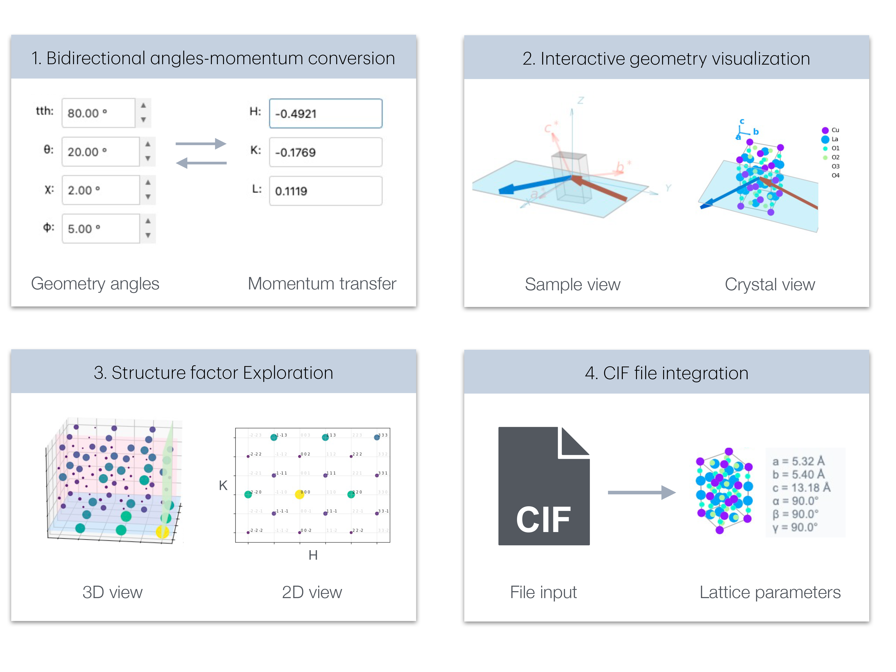
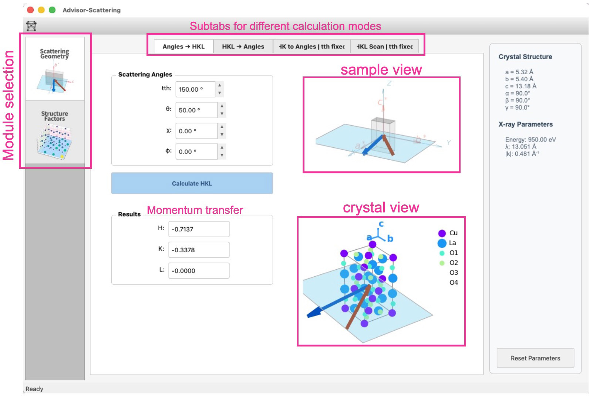
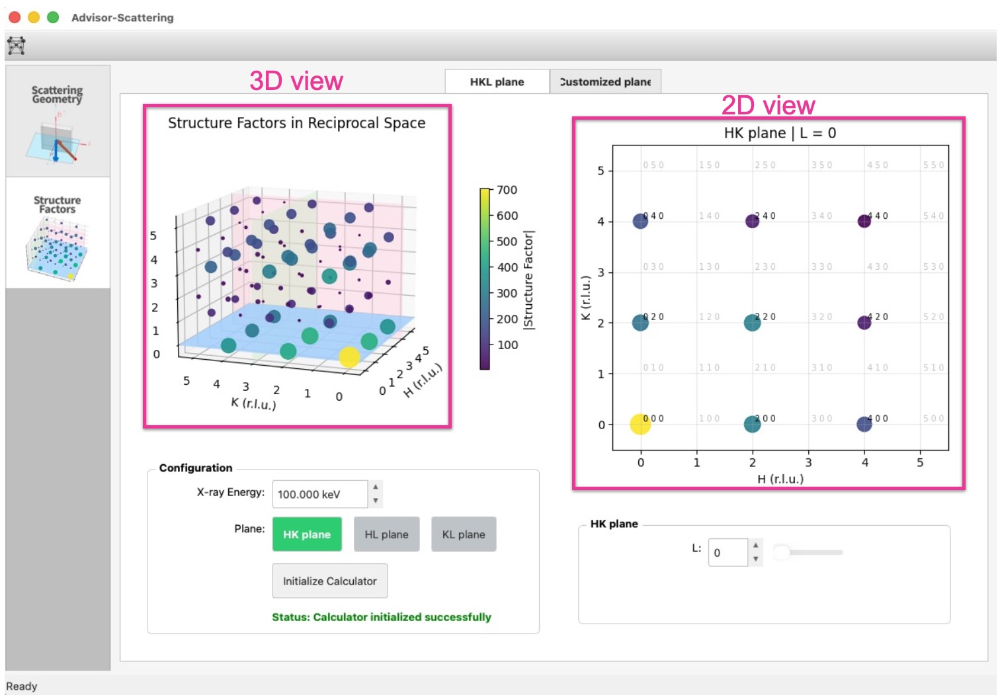

# Summary

X-ray scattering and diffraction experiments are fundamental techniques for 
probing the crystal structure and internal collective excitations. These experiments 
require careful planning of scattering geometry and understanding of the 
relationship between instrumental angles and momentum transfer in reciprocal 
space. 

ADVISOR = ADvanced VIsualization of Scattering ORientation, a Python-based desktop application that provides 
interactive visualization and calculation tools for X-ray scattering and diffraction 
experiment. The software enables researchers to convert between 
instrumental geometry angles $2\theta$, $\theta$, $\phi$, $\chi$,  and momentum transfer $(H, K, L)$ in reciprocal space, visualize scattering geometry in 
three dimensions, and explore structure factors across reciprocal space 
planes—all through an intuitive graphical interface.

# Statement of need
**X-ray scattering**, when energy-resolved, access to collective excitations such as phonons and
other elementary modes—capabilities that make synchrotron-based scattering central to modern
condensed-matter and materials physics [@ament2011; @fink2013; @mitrano2024; @baron2020]. In
contrast, **X-ray diffraction** focuses on Bragg scattering from periodic order, providing
quantitative determination of lattice parameters, symmetry, crystal structure,
strain/microstructure, and phase fractions that underpin structure–property studies and
phase-transition physics [@cullity1986; @bunaciu2015]. Beyond physics, X-ray diffraction methods also have broad applications in
**chemistry** (structure determination and solid-state phase analysis) and in **geology/mineralogy**
(mineral identification and quantitative phase analysis of complex mixtures) [@bunaciu2015].

X-ray scattering and X-ray diffraction experiments are typically carried out at synchrotron
beamlines. Beamtime at synchrotrons is usually highly competitive and only a fraction of requested
beamtime can be granted. Therefore, it is crucial to carefully plan ahead, and make rapid decision
during the allocated beamtime to maximize the scientific output. This practical constraint motivates
fast, user-friendly visualization and planning software tools. 
Planning and quick decision making for X-ray scattering or diffraction experiments requires converting between instrumental coordinates and reciprocal space coordinates. 

Experimentalists must (1) determine 
which angular configurations $(2\theta, \theta, \phi, \chi)$
will access specific momentum transfer $(H, K, L)$
(for scattering experiments) or Bragg reflections
(for diffraction experiments) and vice versa; (2) assess which reflections are kinematically 
accessible at a given photon energy. Although 
well-established in theory [@busing1967; @lumsden2005], these calculations can be tedious and prone
to errors when performed manually, particularly for non-orthogonal crystal 
systems. 

Furthermore, understanding the intensity distribution of structure factors 
across reciprocal space is essential for identifying strong reflections and 
planning efficient measurement strategies. While crystallographic packages [@olex2; @shelx; @vesta;
@recipro] exist, many are either heavy-weight, or
lack interactive visualization capabilities for exploring reciprocal space. They are not specifically
tailored for quick geometry-momentum conversions. 

ADVISOR addresses these needs by providing an open-source tool that combines:

1. **Bidirectional angle-HKL conversion** with real-time feasibility checking
2. **Interactive 3D visualization** of scattering geometry and crystal structures
3. **Structure factor exploration** across arbitrary planes in reciprocal space
4. **CIF file integration** for automatic lattice parameter extraction

The software is designed for beamline scientists and 
researchers preparing synchrotron or laboratory X-ray scattering/diffraction experiments, 
offering immediate visual feedback that accelerates experiment planning and decision making. More
details can be found in the project's documentation [@advisor_doc].

# Software description
Advisor-Scattering is built on PyQt5 [@pyqt] for the graphical interface and 
Matplotlib [@matplotlib] for visualization, with NumPy [@numpy] and SciPy 
[@scipy] underpinning the domain-layer crystallographic and rotation-matrix 
calculations. The architecture separates 
domain logic from user interface components, facilitating maintenance and 
extension. \autoref{fig:overview} illustrates the application's main 
functionalities. The documentation is available at readthedocs [@advisor_doc].

The package consists of two main modules. The first module *Scattering Geometry* enables the conversion between instrumental
angles and momentum transfer in reciprocal space. The second module *Structure Factor*, with its
core based on the Dans_Diffraction library [@dans_diffraction], enables the calculation of structure factors
and visualization.

## Scattering Geometry module

The Scattering Geometry tab implements the core angle-HKL transformation 
mathematics.
Four calculation modes are available:

- **Angles → HKL**: Given instrumental angles (2θ, θ, χ, φ), compute the 
  accessed momentum transfer in reciprocal lattice units.
- **HKL → Angles**: Given target Miller indices, compute all feasible angular 
  solutions. Solutions are color-coded by feasibility (positive θ with 
  θ < 2θ).
- **Fixed-2θ trajectory**: For a fixed scattering angle, compute the angular 
  path required to scan along specified HK directions.
- **HKL scan planning**: Generate angular trajectories for systematic 
  reciprocal space surveys.

All calculations are accompanied by interactive 3D visualizations showing 
the incident and scattered wavevectors, momentum transfer vector, and crystal 
orientation (\autoref{fig:geometry}).

## Structure Factor module

When a CIF file is provided, the Structure Factor module enables exploration of 
diffraction intensities (approximated by structure factors) across reciprocal space. The module leverages the 
Dans_Diffraction library [@dans_diffraction] for atomic form factor and 
structure factor calculations.

Two visualization modes are provided:

- **HKL planes**: A 3D reciprocal space cube with translucent slicing planes 
  (HK, HL, KL) that can be swept through integer L, K, or H values 
  respectively. Synchronized 2D map shows structure factor magnitudes 
  |F(hkl)| on each plane.
- **Custom planes**: Users define arbitrary crystallographic planes by 
  specifying two in-plane vectors (U, V) and a center point in HKL 
  coordinates, enabling visualization of structure factors along any directions.

## Technical implementation

The software follows a domain-controller-view architecture:

- **Domain layer**: Pure Python modules implementing crystallographic 
  calculations without GUI dependencies. This includes real/reciprocal 
  lattice vector computation, Euler angle rotations, diffractometer angle 
  matrices, and structure factor evaluation.
- **Controller layer**: Coordinates data flow between the domain and UI, 
  manages application state, and handles parameter propagation across 
  feature tabs.
- **View layer**: PyQt5 widgets and Matplotlib canvases providing interactive 
  visualizations and input forms.

This separation allows the calculation routines to be imported and used 
independently of the GUI for scripting and automation.

# Mathematics
For a four-circle 
diffractometer with angles $2\theta$ (detector, `tth` in the software), $\theta$ (sample rotation), $\chi$ (tilt), 
and $\phi$ (azimuth). We use the following rotation convention for this software:

$$R_{\text{total}} = R_{\theta} R_{\chi} R_{\phi}$$

The momentum transfer vector is:

$$\mathbf{Q} = \mathbf{k}_f - \mathbf{k}_i$$

The HKL momentum transfer components are defined as the vector components when expressed in the reciprocal lattice basis:

$$ \mathbf{Q} = H \mathbf{a}^* + K \mathbf{b}^* + L \mathbf{c}^*$$

where $\mathbf{a}^*$, 
$\mathbf{b}^*$, 
and $\mathbf{c}^*$ are the reciprocal lattice vectors. The HKL
momentum can be directly calculated from the momentum transfer vector:

$$H = \frac{\mathbf{Q} \cdot \mathbf{a}}{2\pi}, \quad 
K = \frac{\mathbf{Q} \cdot \mathbf{b}}{2\pi}, \quad 
L = \frac{\mathbf{Q} \cdot \mathbf{c}}{2\pi}$$

where $\mathbf{a}$,
$\mathbf{b}$,
and $\mathbf{c}$ are the real-space
lattice vectors.

# Conclusions and future work

Advisor-Scattering provides an accessible, visual approach to X-ray 
scattering experiment planning. By combining real-time angle-momentum transfer conversion 
with interactive 3D visualization and structure factor exploration, the 
software reduces the barrier to understanding reciprocal space geometry and 
accelerates experimental preparation and decision making.

Planned developments include:

- customizable rotation conventions for different beamline geometries
- Export of calculated trajectories to beamline control formats
- Extension to neutron scattering.

# AI usage disclosure

- **Tool use**: Codex 5.2; Claude Sonnet 3.5, 4, 4.5; GPT 5; They were used in the code and the documentation. 
- **The nature and scope of assistance**: Claude Sonnet and GPT 5 assisted in writing code and
  debugging. Codex 5.2 were used in code restructuring. Claude Opus 4.5 and ChatGPT 5.2 assisted in drafting the
  documentation and the paper. 
- **Confirmation of review**: The author has reviewed, edited, and validated all AI-assisted outputs and
  made the core design decisions.

# Acknowledgements

The author acknowledges helpful discussions with beamline scientist colleagues
regarding diffractometer conventions and user interface design.

# References

